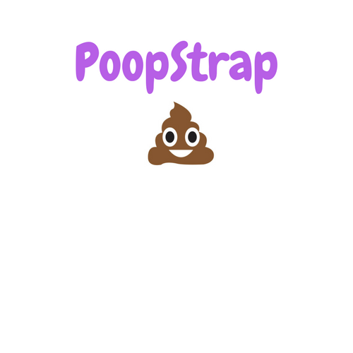

## Challenge Guide

1.) Open the HTML file that your group was assigned to, BUT you do not need to
edit any HTML. The file to edit is "styles.css"

2.) Open the images directory to see how your page should look when successful

3.) Each div should have a height of 100 pixels and should display next to each other
in a row

3.) Make the container div centered and wide enough to take up 80% of the screen

4.) The width of your divs should correspond with the grid class your group was
assigned to, as it relates to a 12-column grid. For example, a "col-1" class should
have 12 columns evenly taking up the full container. Check the images directory for
examples
